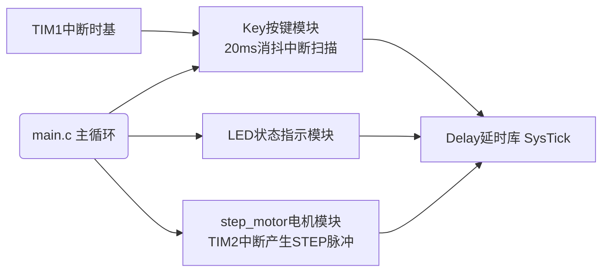

<div align="center">

# 🛠️ STM32‑TMC2209 步进电机驱动控制板

<p>


</p>

> 一体化步进电机运动控制器｜硬件+固件完整开源
> 适合滑台、小型自动化、DIY机器人项目

<!-- 替换为你的实物/原理图截图链接 -->
<!--  -->

</div>

---

## 📋 目录
- [✨ 项目特性](#✨-项目特性)
- [⚡硬件规格](#⚡硬件规格)
- [🧩硬件接口总览](#🧩硬件接口总览)
- [💡电源系统设计亮点](#💡电源系统设计亮点)
- [🗃️固件架构](#🗃️固件架构)
- [📚API快速参考](#📚api快速参考)
- [🚀快速开始](#🚀快速开始)
- [📂项目目录](#📂项目目录)
- [💡后续扩展方向](#💡后续扩展方向)
- [📄开源协议](#📄开源协议)

---

## ✨ 项目特性

> 🟢 **硬件特点**
- ✅ 主控：`STM32F103C8T6` 72M Cortex‑M3，标准库开发
- ✅ 驱动：TMC2209 静音步进驱动，支持64细分，低噪音
- ✅ 输入直流 `28V`，LM2596高效率降压，TVS浪涌保护
- ✅ 4路独立上拉按键输入，硬件IO，软件消抖
- ✅ PC13 用户LED状态指示灯
- ✅ 预留I2C‑OLED接口，可外接屏幕显示状态
- ✅ 标准2.0PH电机插座，两相四线步进电机
- ✅ SWD下载调试口，支持ST‑Link在线调试

> 🟢 **固件特点**
- ✅ 模块化C代码，低耦合，开箱即用
- ✅ 支持**定步数运动 / 连续转动 / RPM转速设置**
- ✅ 定时器中断驱动电机脉冲，不阻塞主循环
- ✅ 定时器1实现按键扫描，20ms消抖非阻塞
- ✅ SysTick高精度us/ms延时
- ✅ 可读取电机运行状态、当前累计步数

---

## ⚡硬件规格

| 参数项 | 参数值 |
|---|---|
| 主控芯片 | STM32F103C8T6 |
| 电机驱动 | TMC2209 |
| 供电输入 | DC 28V |
| 降压芯片 | LM2596S‑5.0 |
| 电机类型 | 两相四线 1.8°步进电机 |
| 默认细分 | 1/64细分 |
| 每圈步数 | 12800 step/r |
| 最大脉冲频率 | 20kHz |
| 用户按键 | 4路(GPIOB0/1/10/11) |
| 用户LED | PC13 |
| 显示接口 | I2C OLED 预留 |

> [!NOTE]
> TMC2209硬件默认1/8细分，固件宏定义配置为`MICRO_STEP=64`，需要硬件跳线配合才能真正64细分。

## 🧩硬件接口总览

<details>
<summary>🔌点击展开接口说明</summary>

1. **Power Input**
    - DC‑005插座，输入28V直流电源
2. **Motor Connector(H3)**
    - PH2.0‑8P：M1B M1A M2A M2B，两相四线步进电机
3. **TMC2209控制接口(H4)**
    - DIR / STEP / EN 控制信号，串联100Ω保护电阻
4. **Key Input**
    - PB0 PB1 PB10 PB11，内部上拉，按键低电平触发
5. **OLED(H5)**
    - I2C SDA SCL，外接0.96寸OLED屏幕
6. **SWD调试口**
    - 下载与在线调试固件

</details>

## 💡电源系统设计亮点

- 🛡️ **浪涌保护**：`SMBJ28CA` TVS抑制高压尖峰，防止上电冲击损坏器件
- ⚡ **高效降压**：LM2596开关电源，28V转5V；再生成3.3V给MCU逻辑
- 🧪 **反向保护**：肖特基二极管1N5822防止电源反接损坏降压芯片
- 🧫 **多级滤波**：大容量电解+陶瓷电容组合，降低电源纹波，电机运行更加稳定

---

## 🗃️固件架构



| 文件 | 模块功能 |
| --- | --- |
| `main.c / main.h` | 程序入口，全局变量，头文件汇总 |
| `step_motor.c/h` | TMC2209驱动，TIM2脉冲发生器，运动控制API |
| `Key.c/h` | 4按键驱动，中断时基消抖，获取按键编号 |
| `LED.c/h` | PC13 LED，开关、翻转 |
| `Timer.c/h` | TIM1初始化，提供按键扫描时基 |
| `Delay.c/h` | SysTick微秒毫秒秒延时 |

> 
> [!IMPORTANT]
> 
> 
> - TIM1：1KHz中断，专门用于按键消抖扫描
> - TIM2：产生步进电机STEP脉冲，独立中断互不干扰
> - 电机运动为非阻塞模式，调用`Motor_MoveSteps()`后，主循环可以继续执行其他业务逻辑

## 📚API快速参考

### 🚗 电机控制API

```
void Motor_Init(void);                     //电机初始化
void Motor_Enable(void);                   //使能电机(锁轴)
void Motor_Disable(void);                 //失能电机(可手转动)
void Motor_SetDir(uint8_t dir);            //DIR_CW正转 / DIR_CCW反转
void Motor_SetFreq(uint16_t freq);         //设置脉冲频率 Hz
void Motor_SetRPM(float rpm);              //设置转速 RPM
void Motor_Start(void);                    //持续旋转
void Motor_Stop(void);                     //立刻停止
void Motor_MoveSteps(int32_t steps);       //运动指定步数，正数正转，负数反转
uint8_t Motor_IsRunning(void);             //查询电机是否运行
int32_t Motor_GetCurSteps(void);           //读取当前累计步数
```

### 🎛️按键 & LED

```
uint8_t Key_GetNum(void);   //返回1‑4对应按键，0代表无按键按下
void LED_ON(void);
void LED_OFF(void);
void LED_Turn(void);        //翻转LED状态
```

## 🚀快速开始

1. **硬件连接**
   - 接入28V直流电源；接好两相四线步进电机；ST‑Link接SWD
2. **编译下载**
   - Keil‑MDK5打开工程，编译下载固件
3. **上电现象**
   - 上电自动执行`Motor_MoveSteps(6400)`电机转动测试
4. **二次开发**
   - 在`while(1)`主循环读取`Key_GetNum()`做按键业务逻辑
   - 使用`LED_Turn()`做状态提示

> 
> 💡示例代码片段放到while(1)：

```
uint8_t key = Key_GetNum();
if(key == 1)
{
    LED_Turn();
    Motor_MoveSteps(6400);
}
```

## 📂项目目录

```
STM32‑TMC2209‑Stepper‑Driver
├─ User                     # 用户应用代码
│  ├─ main.c / main.h
│  ├─ step_motor.c / step_motor.h
│  ├─ Key.c / Key.h
│  ├─ LED.c / LED.h
│  ├─ Timer.c / Timer.h
│  └─ Delay.c / Delay.h
├─ Doc                      # 硬件资料
│  └─ Schematic1.pdf       # 原理图
└─ README.md
```

## 💡后续扩展方向

- 添加限位开关，支持回零、软限位保护
- 增加USART串口，上位机G代码指令控制
- OLED屏幕显示转速、步数、运行状态
- 加加速度S曲线加减速算法
- PCB增加温度检测、过流报警

## 📄开源协议

[%E2%80%91MIT%E2%80%91blue.svg)](./LICENSE)

> 
> MIT License
> 
> 
> 本项目硬件原理图、固件代码全部开源，允许个人、商业修改二次分发，请保留原始项目版权声明。

```

### 美化效果说明：
1. 顶部居中标题 + Github徽章，项目第一眼观感高级；
2. 使用Github支持的`> [!NOTE]`、`> [!IMPORTANT]`彩色提示块（GitHub原生渲染）；
3. `<details>`折叠块收起大段说明，页面简洁；
4. mermaid简易流程图展示软件架构，GitHub原生支持渲染；
5. 清晰分块，图标emoji分区，表格整齐；
6. 目录锚点跳转，长文档方便导航。

### 你需要替换的地方：
1. `<!--  -->` 把注释去掉，填入你的PCB渲染图、实物图片路径；
2. 如果你有LICENSE文件就保留链接，没有可以删掉LICENSE链接；
3. Doc文件夹放你的原理图PDF。

如果你想要，我还可以给你：
1. 配套写一份简短 `CONTRIBUTING.md`（贡献指南）
2. 或者写一份 `Wiki` 的简短大纲。
```
